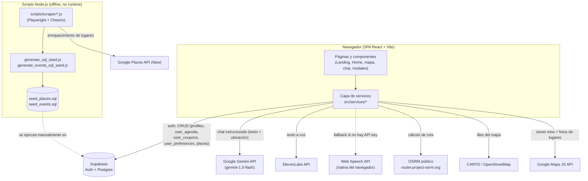

# Documentación Técnica — Cipitour

Complemento del `README.md`: describe la arquitectura, las integraciones externas, el prompt de IA, el modelo de datos y los datos de prueba del proyecto.

## 1. Diagrama de arquitectura



La aplicación es una SPA sin backend propio: todo el código corre en el navegador y habla directamente con servicios de terceros (Supabase, Gemini, ElevenLabs, OSRM, Google Maps). El único "backend" con lógica propia son los scripts Node.js offline que preparan datos para Supabase.

## 2. Modelo de datos

### 2.1 Tablas en Supabase (Postgres)

Inferidas de las consultas en `src/services/*.ts` y de `scripts/generate_sql_seed.js`.

**`profiles`**
| Columna | Tipo | Descripción |
|---|---|---|
| `id` | uuid (PK, = `auth.users.id`) | Usuario dueño del perfil |
| `total_points` | integer | Puntos acumulados de gamificación |

**`user_agenda`**
| Columna | Tipo | Descripción |
|---|---|---|
| `id` | uuid (PK) | |
| `user_id` | uuid (FK → `auth.users`) | |
| `place_name` | text | Nombre del lugar guardado |
| `lat`, `lng` | double | Coordenadas |
| `visit_date` | date, nullable | Fecha planeada de visita |
| `status` | text (`pending` \| `visited`) | Estado del ítem |
| `created_at` | timestamp | |

**`user_coupons`**
| Columna | Tipo | Descripción |
|---|---|---|
| `id` | uuid (PK) | |
| `user_id` | uuid (FK → `auth.users`) | |
| `coupon_code` | text | Código único generado al canjear (`SV-{descuento}-{random}`) |
| `discount_percentage` | integer | Porcentaje de descuento |
| `claimed_at` | timestamp | |

**`user_preferences`**
| Columna | Tipo | Descripción |
|---|---|---|
| `id` | uuid (PK, = `auth.users.id`) | |
| `preferred_categories` | text[] | Categorías elegidas en el onboarding |
| `budget_range` | text | `free`, `1-20`, `20-50`, `50+` |
| `trip_duration` | text | `1-day`, `2-3-days`, `4-7-days`, `1-week+`, `local` |
| `onboarding_completed` | boolean | |
| `updated_at` | timestamp | |

**`places`**
| Columna | Tipo | Descripción |
|---|---|---|
| `id` | uuid (PK) | |
| `name` | text | |
| `description` | text | |
| `lat`, `lng` | double | |
| `category` | text | `cultura`, `aventura`, `gastronomía`, `naturaleza`, `deportes`, `religioso`, `general` |
| `municipality`, `department` | text | Ubicación administrativa (El Salvador) |
| `rating`, `user_ratings_total` | double / integer | Datos de Google Places |
| `images` | text[] | Nombres de foto de Google Places o URLs directas |
| `reviews` | jsonb | Reseñas crudas de Google Places |
| `recommended_age` | text | Generado heurísticamente por categoría |
| `activities` | jsonb | Lista de actividades sugeridas |
| `agenda` | jsonb | Itinerario sugerido (`{ time, description }[]`) |

> No se encontraron migraciones SQL versionadas para `profiles`, `user_agenda`, `user_coupons` ni `user_preferences` — solo el `ALTER TABLE` de `places` en `scripts/generate_sql_seed.js`. Esas tablas se asumen creadas manualmente en el panel de Supabase.

### 2.2 Modelo en memoria (frontend)

**`AppEvent`** (`src/services/events/EventProvider.ts`) — modelo unificado que consume el mapa, ya sea que venga de `places` (Supabase) o de datos mock:

```ts
interface AppEvent {
  id: string;
  title: string;
  description: string;
  lat: number;
  lng: number;
  date: string;
  startTime?: string;
  endTime?: string;
  imageUrl?: string;
  media?: { type: 'image' | 'video'; url: string }[];
  itinerary?: { time: string; description: string }[] | string[];
  activities?: string[];
  price?: number | null;   // null = gratis
  currency?: string;
  category?: 'cultura' | 'aventura' | 'gastronomía' | 'naturaleza' | 'deportes' | 'religioso' | string;
  ageRange?: string;
}
```

**`AIResponse`** (`src/services/ai.ts`) — salida estructurada del chat:

```ts
interface AIResponse {
  text: string;
  suggestedLocation?: { name: string; lat: number; lng: number } | null;
}
```

## 3. Prompts e IA (Google Gemini)

- **Modelo**: `gemini-1.5-flash` (vía `@google/generative-ai`)
- **Modo**: `responseMimeType: "application/json"` con `responseSchema` (Structured Output) — obliga a Gemini a devolver siempre `{ text, suggestedLocation }`.

**System prompt** (`src/services/ai.ts`):

```
Eres un asistente de viajes y turismo mágico para El Salvador (y el mundo). Tu nombre es "El Cipitío", un personaje del folklore salvadoreño, pero tu objetivo PRINCIPAL es ser ÚTIL.
Actúa con este balance:
1. IDENTIDAD (10%): Usa un tono amigable, alguna palabra coloquial salvadoreña ("chero", "púchica", "cipote") de forma natural, y ocasionalmente ríete ("¡Jajaja!").
2. UTILIDAD (90%): Provee información real y valiosa. Cuando recomiendes un lugar, incluye detalles como precios aproximados, clima, seguridad, qué comer ahí o mejor hora para visitar.
3. PRECISIÓN GEOGRÁFICA: Siempre que el usuario pregunte por un lugar o recomendación, debes incluir el nombre del lugar exacto y sus coordenadas precisas (latitud y longitud) en el objeto de ubicación. Si no recomiendas un lugar específico o la pregunta no tiene relación con ubicación, la ubicación debe ser nula.
4. FORMATO: Tus respuestas de texto deben ser conversacionales pero directas, ideales para ser leídas en voz alta.
```

- El historial de chat (`ChatMessage[]`) se envía completo en cada llamada (`role: 'user' | 'model'`).
- Si `suggestedLocation` viene no nulo, el frontend centra el mapa ahí y ofrece guardarlo en la agenda del usuario (+50 pts).
- Si `VITE_GEMINI_API_KEY` no está definida, se omite la llamada y se retorna una respuesta local fija (ver README, sección "Simuladas").

## 4. Integraciones y APIs externas

| Integración | Dónde se usa | Descripción |
|---|---|---|
| **Google Gemini** | `src/services/ai.ts` | Chat del Cipitío con salida JSON estructurada (texto + ubicación). |
| **Supabase Auth** | `src/services/supabase.ts`, `src/pages/Home.tsx` | Login/logout con OAuth de Google (`supabase.auth.signInWithOAuth({ provider: 'google' })`), manejo de sesión reactivo con `onAuthStateChange`. |
| **Supabase Postgres (REST vía supabase-js)** | `src/services/gamification.ts`, `userPreferences.ts`, `events/SupabaseEventProvider.ts` | CRUD sobre `profiles`, `user_agenda`, `user_coupons`, `user_preferences`, `places`. |
| **ElevenLabs API** | `src/services/tts.ts` | `POST https://api.elevenlabs.io/v1/text-to-speech/{voice_id}` (modelo `eleven_multilingual_v2`) para sintetizar la voz del Cipitío. Si falla o no hay API key, hace fallback a `SpeechSynthesis` (Web Speech API) del navegador en español. |
| **OSRM** | `src/components/InteractiveMap.tsx` | `GET https://router.project-osrm.org/route/v1/driving/{lng1},{lat1};{lng2},{lat2}?overview=full&geometries=geojson` — ruta real por carretera entre el usuario y el lugar seleccionado. |
| **CARTO / OpenStreetMap** | `src/components/InteractiveMap.tsx` | Tiles del mapa base (`dark_all`) vía Leaflet `TileLayer`. |
| **Google Maps JavaScript API** | `src/components/GoogleStreetView.tsx`, `events/SupabaseEventProvider.ts` | `StreetViewService`/`StreetViewPanorama` para vistas 360°, y `Places Photo API` (`https://places.googleapis.com/v1/{photoName}/media`) para renderizar fotos guardadas por nombre en `places.images`. |
| **Google Places API (New)** *(solo scripts offline)* | `scripts/scraper/scrape-places.js` | `places:searchText` y detalle de lugar para enriquecer nombre, dirección, coordenadas, rating, reseñas y fotos antes de generar el seed SQL. |
| **Scraping de eventos** *(solo scripts offline)* | `scripts/scraper/scrape-events.js` | Extrae eventos vigentes desde el HTML de `plusticket.sv` (Cheerio) y `eticket.sv` (Playwright, sitio con JS) — no son APIs formales, es HTML scraping. |
| **Geolocalización del navegador** | `src/components/LocationTracker.tsx` | `navigator.geolocation.watchPosition` — ubicación en vivo del usuario para el check-in automático (fórmula de Haversine, radio 50m, 10s). |

## 5. Datos de prueba, mocks y seeders

- **`src/services/events/MockDataTeamProvider.ts`**: implementa `EventProvider` con 5 eventos ficticios completos (Festival de la Piña, Torneo de Surf, Noche de los Farolitos, Ruta de las Flores, Volcán de Santa Ana), incluyendo imágenes de Unsplash, itinerario y actividades. Útil para desarrollar la UI del mapa sin depender de Supabase — basta con reemplazar `SupabaseEventProvider` por `MockDataTeamProvider` en `src/pages/Home.tsx`.
- **`src/services/gamification.ts` → `AVAILABLE_COUPONS`**: catálogo fijo de 3 cupones de ejemplo (pupusas 2x1, descuento en hotel de playa, entrada gratis a museo) usado como "tienda" en `CouponModal`.
- **`scripts/places-list.json`**: lista de nombres/consultas de lugares turísticos de El Salvador usada como entrada para `scrape-places.js`.
- **`scripts/scraper/output/places.raw.json`** y **`events.raw.json`**: salida cruda del scraping (datos reales obtenidos de Google Places / PlusTicket / eTicket), insumo para generar los `.sql` de seed.
- **`scripts/seed_places.sql`** y **`scripts/seed_events.sql`**: scripts SQL listos para ejecutar en el editor SQL de Supabase y poblar la tabla `places` con datos reales de lugares y eventos de El Salvador.
- **`scripts/generate_sql_seed.js`**: además de convertir el JSON crudo a `INSERT`s, **inventa** datos de `recommended_age`, `activities` y `agenda` con reglas simples por palabra clave en la categoría (ver función `getMockDataByCategory`) — es decir, esa parte del seed es sintética, no proviene de Google Places.

## 6. Notas sobre el modelo 3D

- `src/assets/Cipitio.glb` contiene varias animaciones nombradas: `Dancing`, `Running`, `Sad`, `Sitting`, `Walking`, `Waving` (ver `src/components/Assistant3D.tsx`), seleccionadas dinámicamente según el estado del chat (pensando, respuesta feliz, error, etc.).
- `fix_glb.cjs` es un script de mantenimiento puntual (no se ejecuta en runtime) para reparar el retargeting de animaciones del `.glb` usando `@gltf-transform`.
